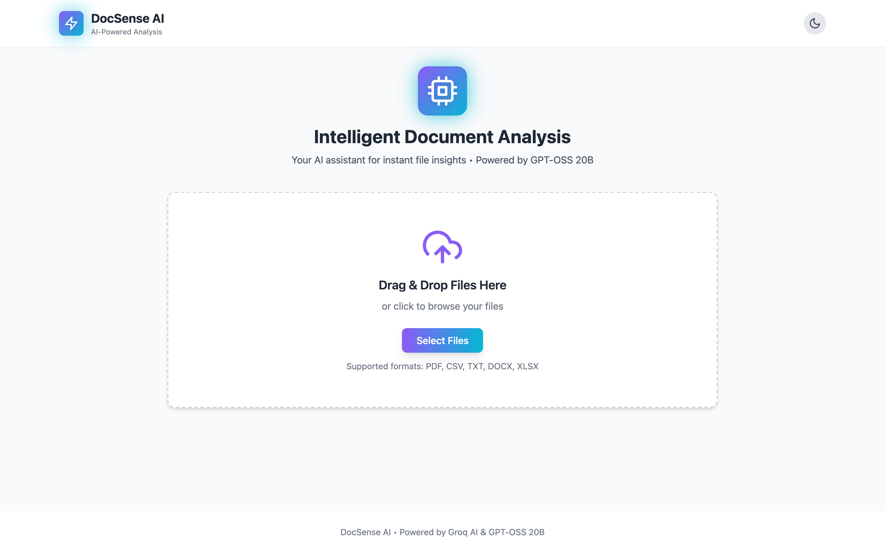
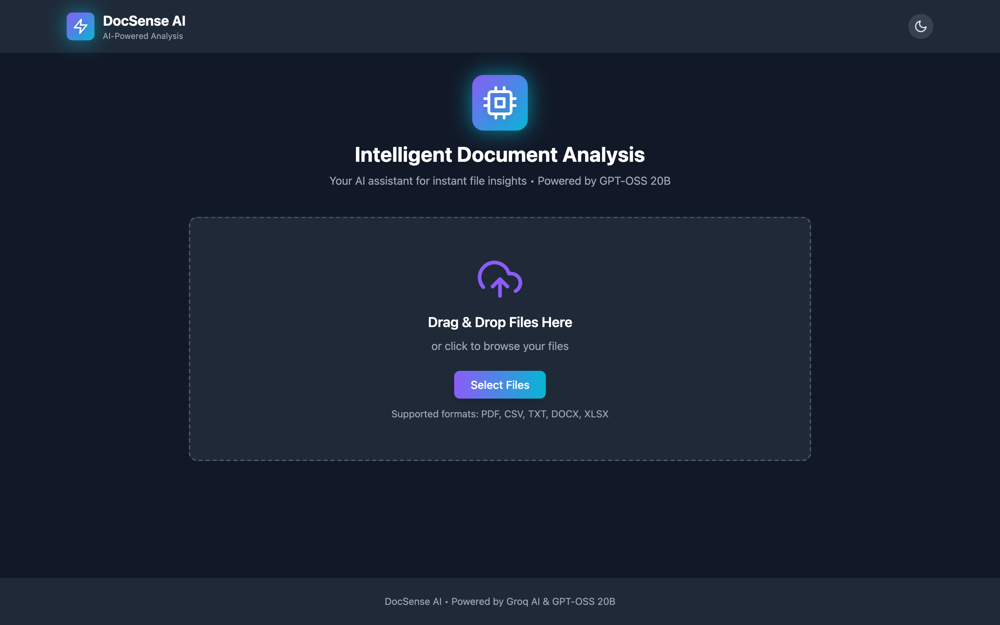
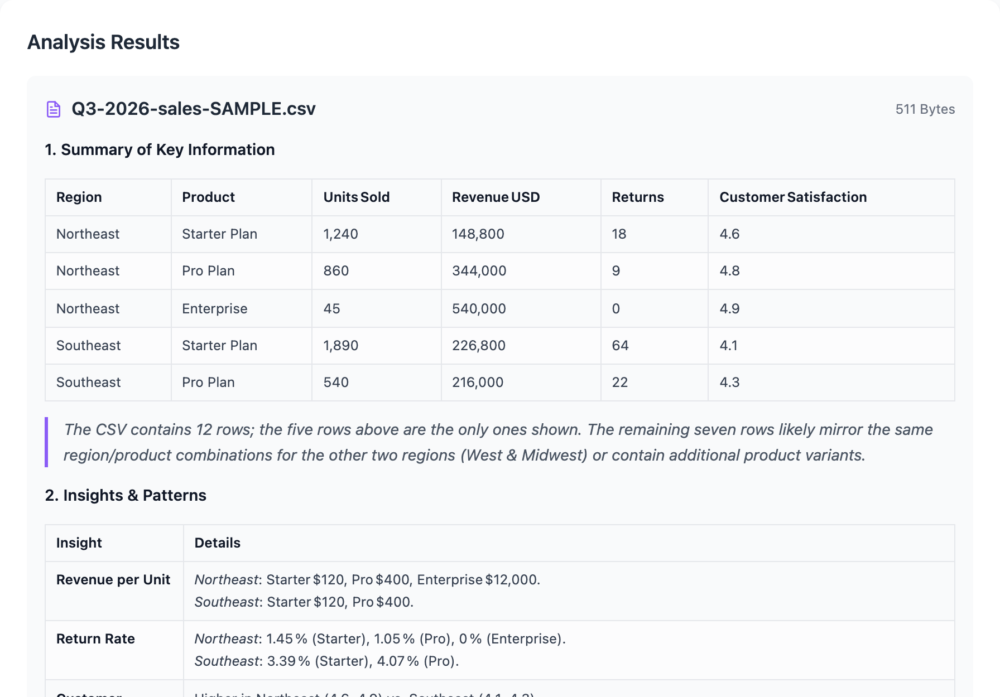
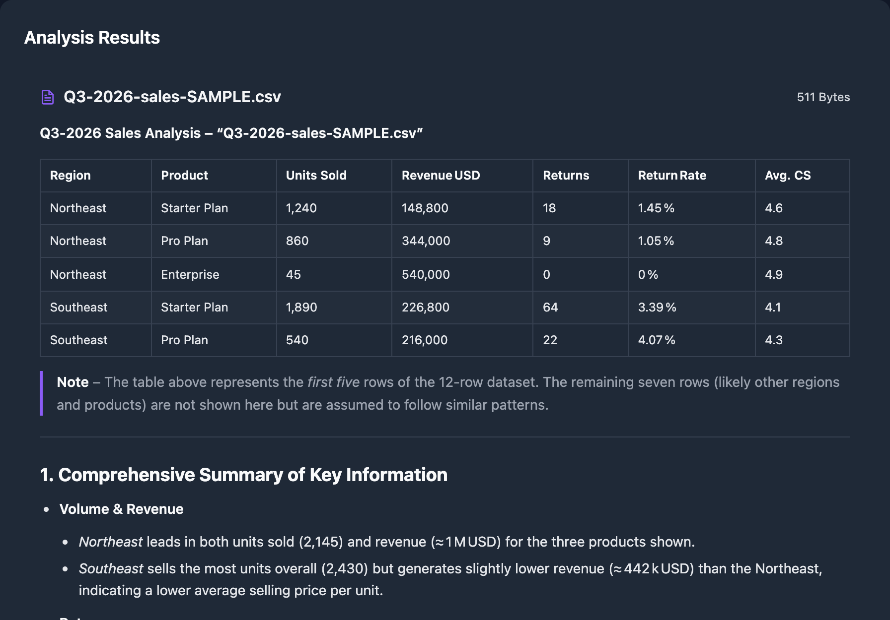

# DocSense AI

<div align="center">
  
  
  <p><strong>Your intelligent AI assistant for document analysis</strong></p>
  
  [](https://opensource.org/licenses/MIT)
  [](https://nodejs.org/)
  [](https://groq.com/)
  
</div>

---

DocSense AI uses Groq Cloud's GPT-OSS 20B model to provide instant insights, summaries, and actionable recommendations from your files. Upload documents and get intelligent AI-powered analysis in seconds.

## ✨ Features

- 🤖 **AI-Powered Analysis** - Uses Groq's GPT-OSS 20B model for intelligent file analysis
- 📄 **Multi-Format Support** - PDF, CSV, TXT, DOCX, XLSX file processing
- 🎨 **Modern UI** - Responsive design with dark mode support
- 📊 **Structured Results** - Get summaries, insights, and actionable recommendations
- 🔒 **Secure** - API key protection and file validation
- ⚡ **Fast Processing** - Optimized for quick analysis and response
- 📥 **Export Options** - Download results as PDF with one click
- 🌙 **Dark Mode** - Easy on the eyes with automatic theme switching

## 📁 Supported File Types

| Format | Description | Max Size |
|--------|-------------|----------|
| **PDF** | Text extraction and document analysis | 10MB |
| **CSV** | Data analysis with insights and patterns | 10MB |
| **TXT** | Plain text content analysis | 10MB |
| **DOCX** | Microsoft Word document processing | 10MB |
| **XLSX** | Excel spreadsheet analysis | 10MB |

## 🚀 Quick Start

### 1. Get Groq API Key

1. Visit [Groq Cloud Console](https://console.groq.com)
2. Sign up or log in to your account
3. Navigate to API Keys section
4. Create a new API key
5. Copy the API key for use in step 4

### 2. Install Dependencies

```bash
npm install
```

### 3. Configure Environment

Edit the `.env` file and replace `your_groq_api_key_here` with your actual Groq API key:

```env
GROQ_API_KEY=gsk_your_actual_api_key_here
PORT=3001
NODE_ENV=development
```

### 4. Start the Server

```bash
# Development mode with auto-reload
npm run dev

# Production mode
npm start
```

### 5. Access the Application

Open your browser and navigate to:
```
http://localhost:3001
```

## 📡 API Endpoints

### Health Check
```
GET /api/health
```
Returns server status and confirms API is running.

### File Analysis
```
POST /api/analyze
```
Upload files for AI analysis. Supports multipart/form-data with files field.

**Request**: Multipart form data with files
**Response**: JSON with analysis results for each file

## 💡 Usage

1. **Upload Files**: Drag and drop files or click to browse
2. **Analyze**: Click "Analyze with DocSense AI" button
3. **Review Results**: Get structured analysis with:
   - Comprehensive summaries
   - Key insights and patterns
   - Actionable recommendations
   - Potential issues or concerns

## ⚙️ Configuration

### Environment Variables

Create a `.env` file in the root directory:

```env
GROQ_API_KEY=your_groq_api_key_here
PORT=3001
NODE_ENV=development

# Optional
GROQ_MODEL=openai/gpt-oss-20b
MAX_TOKENS=3000
```

| Variable | Default | Purpose |
|----------|---------|---------|
| `GROQ_API_KEY` | — | Required. Your Groq Cloud key. |
| `PORT` | `3001` | Port the server listens on. |
| `NODE_ENV` | `development` | Node environment. |
| `GROQ_MODEL` | `openai/gpt-oss-20b` | Override the model without editing code. |
| `MAX_TOKENS` | `3000` | Max completion tokens per file. See the note below before raising. |

### File Limits

- **Maximum file size**: 10MB per file
- **Maximum files per request**: 10 files
- **Supported formats**: PDF, CSV, TXT, DOCX, XLSX only
- **Content sent to the model**: first 4,000 characters per file

### Rate limits worth knowing

Groq's on-demand tier allows **8,000 tokens per minute**, and it counts the prompt plus
`MAX_TOKENS` against that budget *before* generating. Each file costs roughly
`MAX_TOKENS + 1,300` tokens, so at the default of `3000` you get about **two files per
minute**. Beyond that, individual files come back with a rate-limit error while the rest
of the batch still succeeds.

If you analyze large batches, either lower `MAX_TOKENS` (at the cost of truncated
analyses) or move to a paid Groq tier. `openai/gpt-oss-20b` itself supports up to 65,536
completion tokens — the 8,000/minute tier limit is the real constraint, not the model.

## 🛡️ Error Handling

The application provides detailed error messages for:
- Missing API key configuration
- Unsupported file formats
- File size limits exceeded
- Network connectivity issues
- AI processing errors

## 🔧 Development

### Project Structure

```
DocSense-AI/
├── index.html          # Frontend application
├── server.js           # Backend Express server
├── package.json        # Dependencies and scripts
├── .env               # Environment variables
├── .gitignore         # Git ignore rules
├── README.md          # This file
├── docs/
│   └── screenshots/   # README screenshots
└── uploads/           # Temporary file storage (auto-created)
```

### Technologies Used

**Frontend:**
- HTML5, CSS3, JavaScript (ES6+)
- TailwindCSS for styling
- Feather Icons for UI icons
- marked for rendering the model's markdown, DOMPurify for sanitizing it

**Backend:**
- Node.js with Express.js
- Groq SDK for AI integration (`openai/gpt-oss-20b`)
- Multer for file uploads
- Various parsers (pdf-parse, csv-parser, mammoth, xlsx)

## 🐛 Troubleshooting

### Common Issues

1. **"Cannot connect to server"**
   - Ensure the server is running: `npm start`
   - Check the port (default: 3001)

2. **"Groq API key not configured"**
   - Verify your `.env` file has the correct API key
   - Restart the server after updating `.env`

3. **"File too large"**
   - Files must be under 10MB
   - Consider compressing large files

4. **"Unsupported file type"**
   - Only PDF, CSV, TXT, DOCX, XLSX are supported
   - Check file extension is correct

### Getting Help

If you encounter issues:
1. Check the browser console for error messages
2. Review server logs in the terminal
3. Verify your Groq API key is valid and has credits
4. Ensure all dependencies are installed correctly

## 📸 Screenshots

### Upload

Drag and drop, or browse. Multiple files per batch, with format and size validated up front.

| Light | Dark |
|:--:|:--:|
|  |  |

### Analysis Results

Structured output rendered as real headings, tables, and lists — summary, insights,
recommendations, and areas of concern for each file.

| Light | Dark |
|:--:|:--:|
|  |  |

> Screenshots show real output from `openai/gpt-oss-20b`. The data in them is fictional
> sample data generated for the demo.

## 🤝 Contributing

Contributions are welcome! Please feel free to submit a Pull Request.

1. Fork the repository
2. Create your feature branch (`git checkout -b feature/AmazingFeature`)
3. Commit your changes (`git commit -m 'Add some AmazingFeature'`)
4. Push to the branch (`git push origin feature/AmazingFeature`)
5. Open a Pull Request

## 📄 License

This project is licensed under the MIT License - see the [LICENSE](LICENSE) file for details.

## 🙏 Acknowledgments

- Powered by [Groq Cloud](https://groq.com/) and OpenAI GPT-OSS 20B
- Built with [Express.js](https://expressjs.com/)
- Styled with [TailwindCSS](https://tailwindcss.com/)
- Icons by [Feather Icons](https://feathericons.com/)

## 📧 Contact

**Tony Ramirez** - [@gruntcode](https://github.com/gruntcode) - tony.ramirez@gruntcode.com

For questions or support, please [open an issue](https://github.com/gruntcode/DocSense-AI/issues).

---

<div align="center">
  <strong>DocSense AI - Your AI Document Assistant</strong> 🤖⚡
  <br>
  Made with ❤️ for smarter document analysis
</div>
